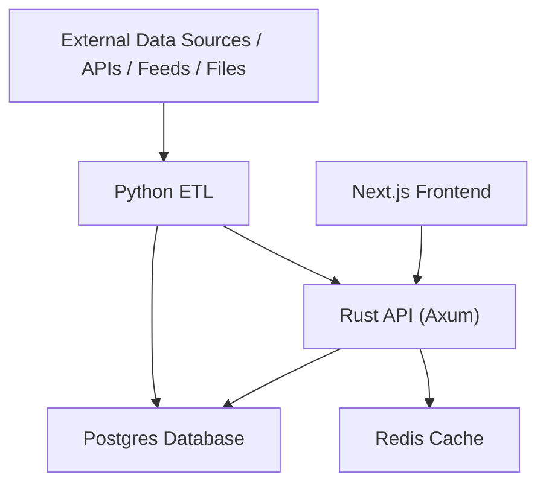
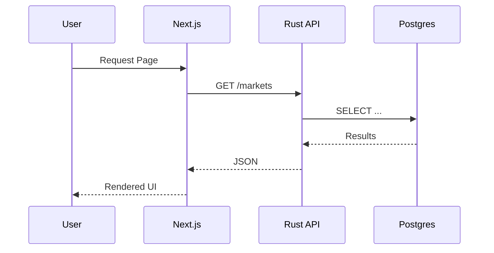

# Foundry90 – Architecture

Foundry90 uses a small but realistic **multi-service platform architecture**.

This includes:

- **Frontend:** Next.js  
- **Backend:** Rust (Axum)  
- **Data Pipeline:** Python ETL  
- **Data Layer:** Postgres + Redis  
- **Deployment:** Vercel + AWS ECS/RDS  
- **Optional:** SwiftUI app hitting the same API  

This architecture teaches breadth, glue, systems-level thinking, and trade-offs.

---

## High-level data & service flow

1. **External data sources** → Python ETL  
2. **Python ETL** → normalizes/transforms → inserts to **Postgres**  
3. **Rust API** → reads from Postgres or Redis  
4. **Next.js frontend** → fetches from Rust API → renders UI  
5. **SwiftUI app (optional)** → also fetches from Rust API  
6. **Logs/metrics** pushed into CloudWatch (or similar)  

---

## Mermaid diagram

This is intentionally flexible. If your capstone domain differs (sports dashboard, analytics platform, risk system, etc.), the shape stays the same.

---

## Request flow (user page load)

---

## ETL flow

- **Extract:** Python fetches data from APIs/websockets/files.  
- **Transform:** Clean & normalize using pandas.  
- **Load:** Insert/UPSERT into Postgres.  

ETL and the API share a schema but operate independently.

---

## Why this architecture?

Because it forces you to learn:

- invocable backend services  
- stateful frontend + data fetching strategies  
- Postgres schema design & indexing  
- Redis caching  
- containerization  
- deployment pipelines  
- monitoring & logs  
- distributed system thinking  

This stack mirrors how small professional platforms are built.
