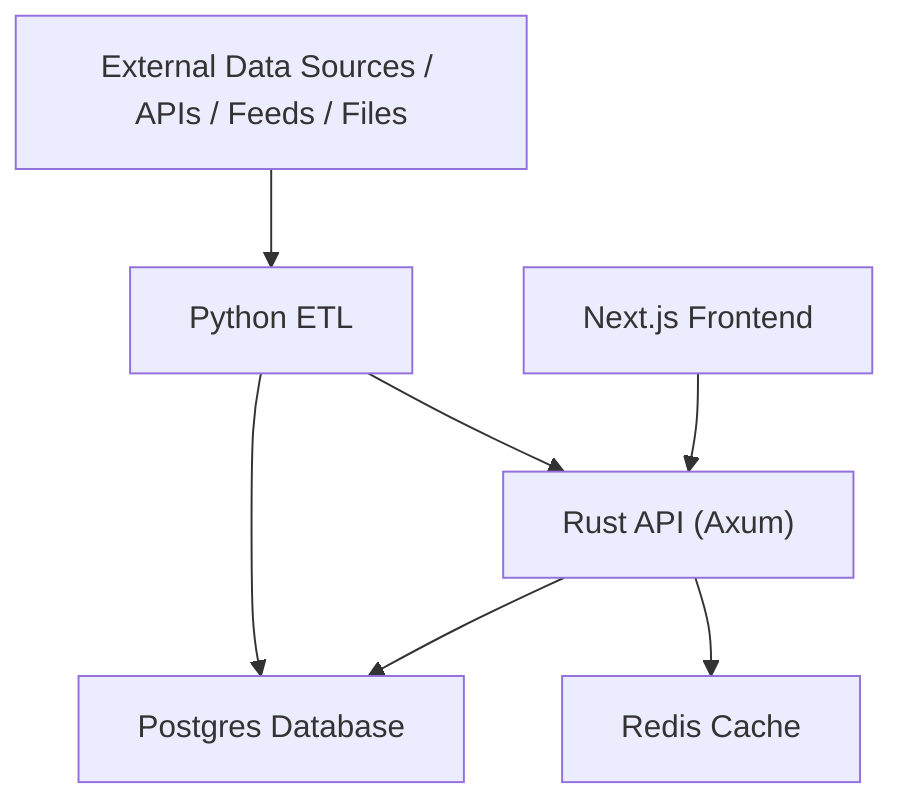
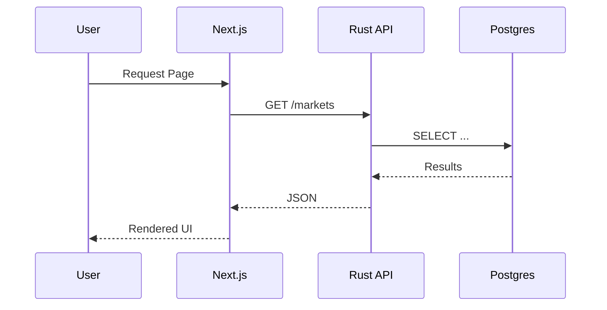

# Foundry90 – Architecture

Foundry90 uses a small but realistic **multi-service platform architecture**.

This includes:

- **Frontend:** Next.js  
- **Backend:** Rust (Axum)  
- **Data Pipeline:** Python ETL  
- **Data Layer:** Postgres + Redis  
- **Deployment:** Vercel + AWS ECS/RDS  
- **Optional:** SwiftUI app hitting the same API  

This architecture teaches breadth, glue, systems-level thinking, and trade-offs.

---

## High-level data & service flow

1. **External data sources** → Python ETL  
2. **Python ETL** → normalizes/transforms → inserts to **Postgres**  
3. **Rust API** → reads from Postgres or Redis  
4. **Next.js frontend** → fetches from Rust API → renders UI  
5. **SwiftUI app (optional)** → also fetches from Rust API  
6. **Logs/metrics** pushed into CloudWatch (or similar)  

---

## Mermaid diagram



This is intentionally flexible. If your capstone domain differs (sports dashboard, analytics platform, risk system, etc.), the shape stays the same.

---

## Request flow (user page load)



---

## ETL flow

- **Extract:** Python fetches data from APIs/websockets/files.  
- **Transform:** Clean & normalize using pandas.  
- **Load:** Insert/UPSERT into Postgres.  

ETL and the API share a schema but operate independently.

---

## Why this architecture?

Because it forces you to learn:

- invocable backend services  
- stateful frontend + data fetching strategies  
- Postgres schema design & indexing  
- Redis caching  
- containerization  
- deployment pipelines  
- monitoring & logs  
- distributed system thinking  

This stack mirrors how small professional platforms are built.

---

## Service Communication Patterns

### Frontend to Backend

- **HTTP/JSON:** Standard REST API calls
- **Server Components:** Next.js can fetch directly from your Rust API
- **Client Components:** Use `fetch` or a library like `axios` for API calls
- **Error Handling:** Implement proper error boundaries and fallback UI

### Backend to Database

- **Connection Pooling:** Use connection pools (sqlx, diesel, etc.) to manage DB connections
- **Query Optimization:** Use prepared statements, indexes, and efficient queries
- **Transactions:** Use transactions for multi-step operations that must be atomic

### Backend to Cache

- **Cache-Aside Pattern:** Check cache first, fall back to DB if miss
- **TTL Management:** Set appropriate expiration times
- **Cache Invalidation:** Invalidate cache when data changes

### ETL to Database

- **Batch Inserts:** Use bulk insert operations for efficiency
- **Upsert Logic:** Handle updates vs. inserts (ON CONFLICT in Postgres)
- **Idempotency:** Make ETL runs safe to re-run

---

## Deployment Architecture

### Development

```
Local Machine
├── Docker Compose
│   ├── Postgres (localhost:5432)
│   ├── Redis (localhost:6379)
│   ├── Next.js (localhost:3000)
│   ├── Rust API (localhost:3001)
│   └── Python ETL (scheduled jobs)
```

### Production

```
Internet
├── Vercel (Next.js Frontend)
│   └── HTTPS → AWS ECS (Rust API)
│       ├── RDS (Postgres)
│       └── ElastiCache (Redis)
└── ECS Task (Python ETL)
    └── Scheduled via EventBridge/Cron
```

---

## Data Flow Examples

### User Views Market List

1. User requests `/markets` page
2. Next.js Server Component fetches from Rust API
3. Rust API checks Redis cache
4. If cache miss, query Postgres
5. Return data, cache it in Redis
6. Render page with market list

### ETL Updates Prices

1. Python ETL script runs (scheduled or manual)
2. Fetches data from external API
3. Transforms data (normalize, clean)
4. Upserts into Postgres `prices` table
5. Optionally: invalidates Redis cache for affected markets
6. Logs completion status

### Real-Time Price Update (Advanced)

1. External data source pushes update (WebSocket or polling)
2. Python ETL receives update
3. Updates Postgres
4. Publishes event to Redis pub/sub or message queue
5. Rust API subscribes to events
6. Rust API pushes update to frontend via WebSocket
7. Frontend updates UI in real-time

---

## Scaling Considerations

As your system grows, consider:

- **Database:** Read replicas, connection pooling, query optimization
- **API:** Horizontal scaling (multiple API instances), load balancing
- **Cache:** Redis cluster for high availability
- **ETL:** Parallel processing, job queues (SQS, RabbitMQ)
- **Frontend:** CDN for static assets, edge caching

For Foundry90, start simple. These are considerations for future growth, not requirements.

---

## Security Considerations

- **API Authentication:** Use API keys, JWT tokens, or OAuth
- **Database Security:** Use connection strings with credentials, restrict network access
- **Environment Variables:** Never commit secrets; use proper secret management
- **HTTPS:** Always use HTTPS in production
- **Input Validation:** Validate and sanitize all inputs
- **SQL Injection:** Use parameterized queries (sqlx handles this)

---

## Monitoring Points

Key places to add observability:

- **API Endpoints:** Log requests, response times, errors
- **Database Queries:** Log slow queries, connection issues
- **ETL Jobs:** Log start/end times, records processed, errors
- **Cache:** Monitor hit rates, memory usage
- **Frontend:** Track page loads, API call failures, user errors

---

## Common Patterns

### Health Checks

Every service should expose a `/health` endpoint that checks:
- Service is running
- Database connectivity
- Cache connectivity (if used)
- Any critical dependencies

### Error Handling

- **API:** Return appropriate HTTP status codes (400, 404, 500, etc.)
- **Frontend:** Show user-friendly error messages
- **ETL:** Log errors, retry transient failures, alert on persistent failures

### Configuration

- **Environment Variables:** Use `.env` files for local, cloud secrets for production
- **Feature Flags:** Consider feature flags for gradual rollouts
- **Service Discovery:** For now, use hardcoded URLs; later consider service discovery

---

## Trade-offs to Consider

- **Monolith vs. Microservices:** Foundry90 uses a small microservices approach; consider when to split further
- **SQL vs. NoSQL:** Postgres is a good default; consider alternatives for specific use cases
- **Synchronous vs. Asynchronous:** Most operations are sync; consider async for long-running tasks
- **Cache Strategy:** Cache everything vs. cache nothing vs. selective caching
- **Deployment Frequency:** Manual vs. automated deployments

There are no "right" answers – only trade-offs based on your constraints and goals.

---

## Related Documentation

- **Weekly Exercises:** See [`03_weekly_exercises.md`](./03_weekly_exercises.md) for week-by-week implementation
- **Repo Structure:** See [`04_repo_template.md`](./04_repo_template.md) for folder organization
- **Capstone Guide:** See [`07_capstone_guide.md`](./07_capstone_guide.md) for architectural expectations
- **Glossary:** See [`glossary.md`](./glossary.md) for explanations of technologies used
