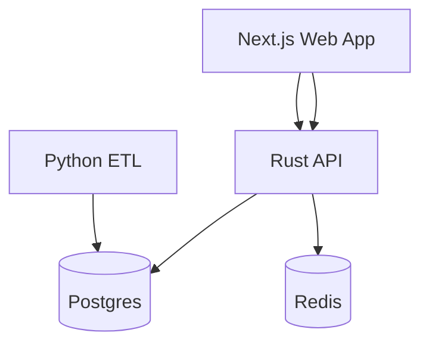

# Foundry90 Documentation

This folder contains **supporting documentation, visual assets, and generated materials** that complement the Foundry90 curriculum and capstone projects.

---

## 📂 What Belongs Here

### Visual Assets

- **Architecture diagrams** (Mermaid source files `.mmd` and exported images `.png`, `.svg`)
- **Sequence diagrams** showing system interactions
- **Flow charts** for processes and workflows
- **System design diagrams**

### Branding & Design

- **Logos** (PNG, SVG formats)
- **Color palettes** (documentation or config files)
- **Typography guidelines**
- **Design system documentation**

### Generated Materials

- **PDF exports** of curriculum overviews
- **Presentation slides** (if created)
- **Printable reference sheets**
- **Cheat sheets** for quick reference

### Documentation Exports

- **API documentation** (if generated from code)
- **Architecture decision records (ADRs)**
- **Deployment guides**
- **Troubleshooting guides**

---

## 📁 Suggested Structure

As the project grows, you might organize it like:

```
docs/
├── architecture/
│   ├── system_overview.mmd
│   ├── system_overview.png
│   ├── data_flow.mmd
│   └── deployment.mmd
├── branding/
│   ├── foundry90_logo.svg
│   ├── foundry90_logo.png
│   ├── color_palette.md
│   └── typography.md
├── presentations/
│   └── foundry90_overview.pdf
├── reference/
│   ├── api_quick_reference.md
│   └── deployment_checklist.md
└── README.md (this file)
```

---

## 🎨 Creating Visual Assets

### Mermaid Diagrams

Foundry90 uses [Mermaid](https://mermaid.js.org/) for diagrams because:
- Text-based (version control friendly)
- Easy to edit and maintain
- Can be rendered in GitHub, documentation sites, etc.

**Example Mermaid file** (`architecture/system_overview.mmd`):



**To render:**
- Use a Mermaid editor: https://mermaid.live/
- Or use a tool like `mermaid-cli`: `mmdc -i system_overview.mmd -o system_overview.png`

### Architecture Diagrams

When creating architecture diagrams, include:
- **Services** and their relationships
- **Data flow** (where data comes from and goes)
- **External dependencies** (APIs, databases, etc.)
- **Deployment boundaries** (what runs where)

### Sequence Diagrams

Use sequence diagrams to show:
- API request/response flows
- ETL pipeline steps
- Authentication flows
- Error handling paths

---

## 📄 Documentation Types

### Architecture Decision Records (ADRs)

If you document architectural decisions, use the ADR format:

```
docs/
  adr/
    0001-use-monorepo-structure.md
    0002-rust-for-backend.md
    0003-postgres-as-primary-db.md
```

**ADR Template:**
```markdown
# ADR-0001: Use Monorepo Structure

## Status
Accepted

## Context
We need to organize multiple services (web, API, ETL) in a way that supports development and deployment.

## Decision
Use a monorepo structure with separate apps/ directories.

## Consequences
- ✅ Easier cross-service development
- ✅ Shared tooling and configs
- ⚠️ Larger repository size
- ⚠️ Need workspace tooling (pnpm, Cargo)
```

### Deployment Guides

Step-by-step guides for:
- Setting up local development
- Deploying to staging
- Deploying to production
- Rollback procedures
- Disaster recovery

### Troubleshooting Guides

Common issues and solutions:
- Service won't start
- Database connection failures
- Docker issues
- Environment variable problems
- Port conflicts

---

## 🌐 Publishing Documentation

### GitHub Pages

If you want to publish Foundry90 documentation as a website:

1. Enable GitHub Pages in repository settings
2. Point it to `/docs` directory
3. Use a static site generator (optional):
   - **MkDocs** – Python-based, great for technical docs
   - **Docusaurus** – React-based, feature-rich
   - **VitePress** – Vue-based, fast and simple

### Static Site Generators

**MkDocs Example:**
```bash
pip install mkdocs mkdocs-material
mkdocs new .
mkdocs serve  # Preview locally
mkdocs build  # Build static site
```

**Docusaurus Example:**
```bash
npx create-docusaurus@latest docs-site classic
cd docs-site
npm start  # Preview locally
npm run build  # Build static site
```

---

## 🔗 Integration with Curriculum

This `docs/` folder complements but doesn't replace:

- **`curriculum/`** – The main learning materials (markdown files)
- **`reference/`** – Code examples and patterns
- **`starter-kit/`** – Project templates

Think of it as:
- **Curriculum** = What to learn
- **Reference** = How to code it
- **Docs** = How to visualize and document it

---

## 📝 Best Practices

### Version Control

- **Commit visual assets** (diagrams, logos) so they're tracked
- **Keep Mermaid source files** alongside rendered images
- **Use descriptive filenames** that indicate purpose and version

### Organization

- **Group related files** in subdirectories
- **Use consistent naming** (e.g., `system_overview.mmd`, `system_overview.png`)
- **Document what each file is** in this README or in file headers

### Maintenance

- **Update diagrams** when architecture changes
- **Keep branding assets** consistent across versions
- **Archive old versions** if needed (use `archive/` subdirectory)

---

## 🚀 Getting Started

1. **Create subdirectories** as needed (e.g., `architecture/`, `branding/`)
2. **Add your first diagram** – Start with a system overview
3. **Document your decisions** – Use ADRs if making architectural choices
4. **Share assets** – Make sure they're accessible to the Foundry90 community

---

## 📚 Examples

### Example: System Architecture Diagram

Create `architecture/system_overview.mmd`:

```mermaid
graph TB
    subgraph "Frontend"
        Web[Next.js Web App<br/>Port 3000]
    end
    
    subgraph "Backend"
        API[Rust API<br/>Port 3001]
    end
    
    subgraph "Data Layer"
        DB[(Postgres<br/>Port 5432)]
        Cache[(Redis<br/>Port 6379)]
    end
    
    subgraph "ETL"
        ETL[Python ETL<br/>Scheduled Jobs]
    end
    
    Web -->|HTTP/JSON| API
    API -->|SQL| DB
    API -->|Key-Value| Cache
    ETL -->|SQL| DB
    
    style Web fill:#61dafb
    style API fill:#ce412b
    style DB fill:#336791
    style Cache fill:#dc382d
    style ETL fill:#3776ab
```

### Example: Deployment Architecture

Create `architecture/deployment.mmd`:

```mermaid
graph TB
    subgraph "Production"
        Vercel[Vercel<br/>Next.js Deployment]
        ECS[AWS ECS<br/>Rust API]
        RDS[AWS RDS<br/>Postgres]
        ElastiCache[AWS ElastiCache<br/>Redis]
    end
    
    Vercel -->|HTTPS| ECS
    ECS -->|SQL| RDS
    ECS -->|Key-Value| ElastiCache
    
    style Vercel fill:#000000
    style ECS fill:#ff9900
    style RDS fill:#232f3e
    style ElastiCache fill:#ff9900
```



---

## 🤝 Contributing

When adding documentation:

1. **Follow the structure** – Use appropriate subdirectories
2. **Include source files** – For diagrams, include both `.mmd` and rendered formats
3. **Update this README** – Add entries for new major assets
4. **Keep it current** – Update docs when systems change

---

**Current Status**: This directory is ready for content. As Foundry90 grows, visual assets, diagrams, and supporting documentation will be added here.
